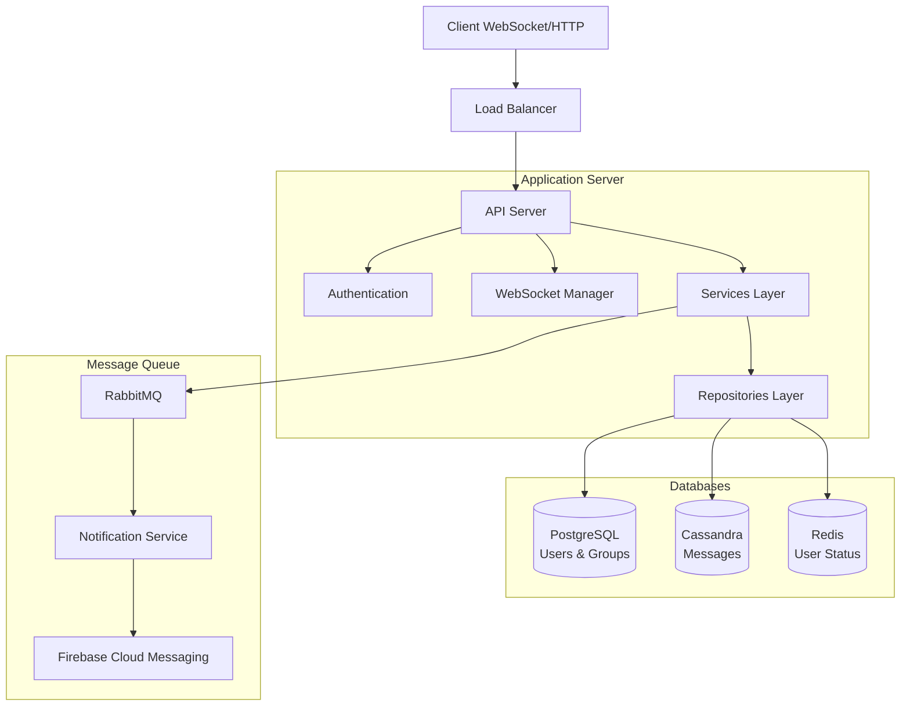

# Real-Time Chat Application Architecture

## System Architecture



## Core Components

### 1. API Layer (`internal/api/`)
- **HTTP Handlers**: REST endpoints for user management, group operations, and message handling
- **WebSocket Handler**: Real-time message delivery and status updates
- **Middleware**: Authentication, logging, and request validation

### 2. Services Layer (`internal/service/`)
- **User Service**: User management, authentication, and status tracking
- **Group Service**: Group creation, membership, and permissions
- **Message Service**: Message delivery and storage
- **Notification Service**: Push notification handling via FCM
- **WebSocket Manager**: Real-time connection management

### 3. Repository Layer (`internal/repository/`)
- **PostgreSQL**: Users, groups, and relationships
- **Cassandra**: Message storage and retrieval
- **Redis**: User status and session management

## Data Flow

1. **Authentication Flow**
   ```
   Client -> API -> UserService -> PostgreSQL
                 -> Redis (session)
   ```

2. **Message Flow**
   ```
   Client -> WebSocket -> MessageService -> Cassandra (store)
                                       -> WebSocket Manager (deliver)
                                       -> RabbitMQ -> FCM (offline users)
   ```

3. **Group Operations**
   ```
   Client -> API -> GroupService -> PostgreSQL
                               -> WebSocket Manager (updates)
   ```

## Database Schema

### PostgreSQL Tables
- Users (auth & profile)
- Groups (info & settings)
- GroupMembers (relationships)

### Cassandra Tables
- Messages (optimized for chat history)
- Message indices for search

### Redis Data
- User sessions
- Online status
- Rate limiting

## Features

1. **Real-time Communication**
   - WebSocket-based messaging
   - Typing indicators
   - Online/offline status
   - Read receipts

2. **Group Management**
   - Create/edit groups
   - Member management
   - Role-based permissions
   - Group messages

3. **Message Features**
   - Text messages
   - Media attachments
   - Message editing
   - Message deletion
   - Reply threading

4. **Notifications**
   - Push notifications
   - Email notifications
   - Custom notification settings

## Setup and Deployment

### Prerequisites
- Docker and Docker Compose
- Firebase project (for FCM)

### Development Setup
```bash
# Start development environment
docker compose -f docker-compose.dev.yml up -d

# View logs
docker compose -f docker-compose.dev.yml logs -f

# Run migrations
docker compose -f docker-compose.dev.yml exec app ./scripts/migrate.sh up

# Rebuild specific service
docker compose -f docker-compose.dev.yml build app

# Stop development environment
docker compose -f docker-compose.dev.yml down
```

The development environment includes:
- Hot reloading using Air
- Development database with sample data
- Development tools (pgAdmin, Redis Commander)
- Automatic migration running
- Exposed ports for debugging

### Development Tools
- PostgreSQL Admin: http://localhost:5050
- Redis Commander: http://localhost:8081
- RabbitMQ Management: http://localhost:15672
- Cassandra CQL Shell: `docker compose -f docker-compose.dev.yml exec cassandra cqlsh`

### Production Deployment
```bash
# Build and deploy production environment
docker compose up -d

# Scale specific services
docker compose up -d --scale app=3
```

### Docker Configuration Files
- `docker-compose.dev.yml`: Development environment with debugging tools
- `docker-compose.yml`: Production environment
- `Dockerfile.dev`: Development image with hot reloading
- `Dockerfile`: Production image

### Development vs Production
| Feature | Development | Production |
|---------|-------------|------------|
| Hot Reload | Yes | No |
| Debug Tools | Yes | No |
| Sample Data | Yes | No |
| Optimization | No | Yes |
| Security | Basic | Enhanced |

## Scaling Considerations

1. **Horizontal Scaling**
   - Stateless API servers
   - WebSocket connection sticky sessions
   - Distributed caching

2. **Database Scaling**
   - PostgreSQL read replicas
   - Cassandra cluster expansion
   - Redis cluster

3. **Message Queue**
   - RabbitMQ clustering
   - Message persistence
   - Dead letter queues

## Monitoring and Maintenance

1. **Health Checks**
   - Database connections
   - Message queue status
   - WebSocket connections

2. **Metrics**
   - Request latency
   - Message throughput
   - Error rates
   - Resource usage

3. **Logging**
   - Structured JSON logs
   - Error tracking
   - Audit trails

## Security Measures

1. **Authentication**
   - JWT-based auth
   - Refresh tokens
   - Session management

2. **Data Protection**
   - TLS encryption
   - Message encryption
   - Rate limiting
   - Input validation

3. **Access Control**
   - Role-based access
   - Group permissions
   - API scoping

## Contributing

1. Fork the repository
2. Create a feature branch
3. Make your changes
4. Run tests and linting
5. Submit a pull request

## License

This project is licensed under the MIT License. See LICENSE file for details. 